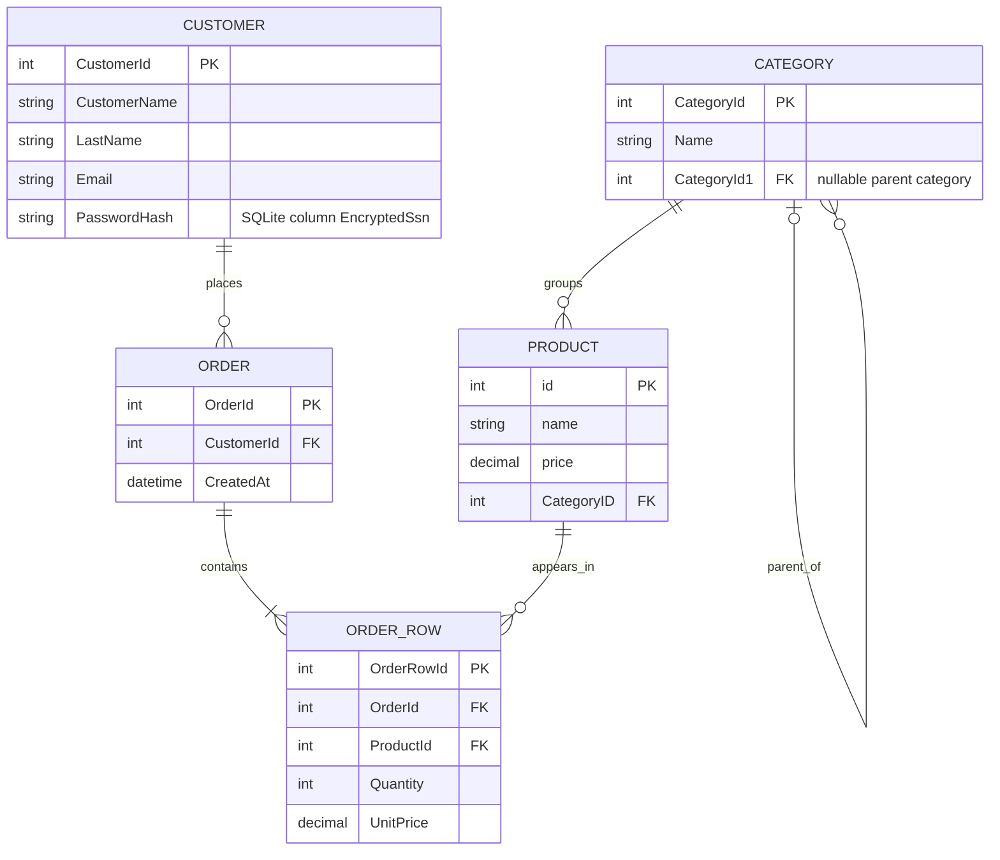

# ER-diagram for WORK Customer

Diagrammet nedan beskriver `ECommerceContext` och modellerna i koden. Namnen ar de faktiska .NET/EF Core-egenskaperna och SQLite-kolumnerna.

## Relationer och kardinaliteter

- En `Customer` kan ha noll eller flera `Order`. Varje `Order` tillhor exakt en `Customer` via `Order.CustomerId`.
- En `Order` har en eller flera `OrderRow`. Varje `OrderRow` tillhor exakt en `Order` via `OrderRow.OrderId`.
- En `Product` kan forekomma i noll eller flera `OrderRow`. Varje `OrderRow` refererar exakt en `Product` via `OrderRow.ProductId`.
- En `Category` kan ha noll eller flera `Product`. Varje `Product` tillhor exakt en `Category` via `Product.CategoryID`.
- En `Category` kan ha en valfri parent-kategori via `Category.CategoryId1`. En parent kan ha noll eller flera underkategorier via `Category.Categories`.

Det finns ingen relation mellan `Order` och `Category`. `OrderDate` och `ParentId` anvands inte i implementationen; motsvarande egenskaper ar `CreatedAt` och `CategoryId1`.

## Losenord

`Customer.PasswordHash` lagrar inte klartext. I den befintliga databasen mappas egenskapen till SQLite-kolumnen `EncryptedSsn`. `PasswordHasher` anvander PBKDF2 med SHA-256, ett slumpmassigt 16-byte salt och 100 000 iterationer. Det lagrade formatet ar:

`iterations:base64(salt):base64(hash)`

Verifiering sker med konstanttidsjamforelse.
